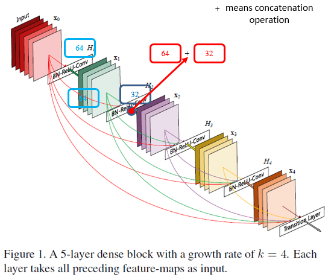

# A MxNet implementation of DenseNet with BC structure

This a [MxNet](http://mxnet.io/) implementation of DenseNet-BC architecture as described in the paper [Densely Connected Convolutional Networks](https://arxiv.org/pdf/1608.06993v3.pdf) by Gao Huang, Zhuang Liu, Kilian Q. Weinberger, Laurens van der Maaten.

This implementation only focus on imagenet'12 dataset at present. The training procedure is ongoing. So, I hope anyone who are mxnet fun can test this code with me. When I finish, I will update more information about training and validation.

Their official implementation and many other third-party implementations can be found in the [liuzhuang13/DenseNet](https://github.com/liuzhuang13/DenseNet) repo on GitHub.

This is a basic dense block (figure is modified from the [original paper](https://arxiv.org/pdf/1608.06993v3.pdf)). Each layer takes all preceding feature maps as input. It is a very interesting and simple design.

I very thanks [tornadomeet, Wei Wu](https://github.com/tornadomeet). This implementation of DenseNet is adapted from his [Resnet](https://github.com/tornadomeet/ResNet) codes. I also refered other third-part implementations, such as 
two version of PyTorch

1. [Brandon Amos](https://github.com/bamos)
(https://github.com/bamos/densenet.pytorch/blob/master/densenet.py)  
2. [Andreas Veit](https://github.com/andreasveit)
(https://github.com/andreasveit/densenet-pytorch/blob/master/densenet.py)

one version of MxNet (without BC structure)

3. [Nicatio](https://github.com/Nicatio)
(https://github.com/Nicatio/Densenet/blob/master/mxnet/symbol_densenet.py)

